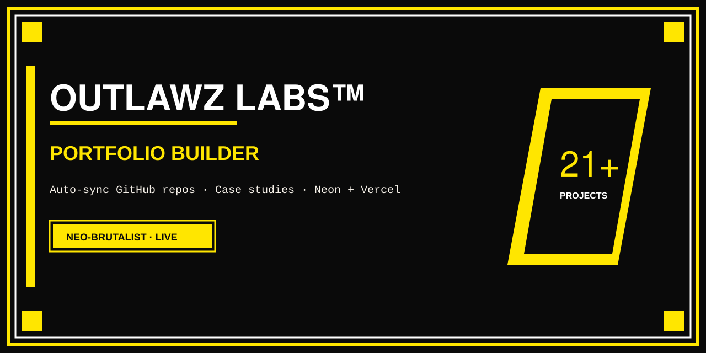

# Portfolio Builder — OUTLAWZ LABS™




> Neo-brutalist personal portfolio for **OutLawZ Labs** — auto-syncs public GitHub repos, stores case studies (Overview / Problem / Solution) in Neon, and deploys on Vercel.

**Live site:** [outlawz-labs-portfolio.vercel.app](https://outlawz-labs-portfolio.vercel.app)  
**API:** [outlawz-portfolio-api.vercel.app](https://outlawz-portfolio-api.vercel.app/api/github)

## Social preview

Repo social card (1280×640, black / `#FFE600`):

- Vector: [`social-preview.svg`](./social-preview.svg)
- For **GitHub → Settings → Social preview**, upload a PNG export of the same art (or use the SVG in the README).

## Features

- **Auto GitHub catalog** — all public repos (hide with topic `portfolio-hide` or make private)
- **Case studies** — Overview, Problem, Solution, tech stack in PostgreSQL (Neon)
- **Featured projects** — recent repos + DB-enriched detail pages
- **API** — `/api/github`, `/api/projects`, `/api/projects/featured`, `/api/projects/by-slug/:slug`
- **Admin** — password-protected project editing (default local: `outlawz2025`)
- **Design** — black / `#FFE600` neo-brutalism (Space Mono + Bebas Neue)

## Monorepo layout

```
artifacts/portfolio/     # React + Vite frontend
artifacts/api-server/    # Full Express API (workspace)
lib/                     # Shared DB + API client packages
deploy-package/          # SQL setup + static deploy notes
social-preview.svg       # Open Graph / README card
vercel.json              # Vercel: build portfolio only + SPA rewrites
```

Production API (serverless): **outlawz-portfolio-api** on Vercel.

## Installation / local development

Requires **Node 20+** and **pnpm**.

```bash
git clone https://github.com/0utLawzz/Portfolio-Builder.git
cd Portfolio-Builder
pnpm install

cd artifacts/portfolio
pnpm dev
# → http://localhost:5173
# /api is proxied to https://outlawz-portfolio-api.vercel.app
```

Production build:

```bash
pnpm --filter @workspace/portfolio build
# output: artifacts/portfolio/dist/public
```

## Environment variables

### Portfolio (`outlawz-labs-portfolio`)

| Variable | Purpose |
|----------|---------|
| `DATABASE_URL` | Optional if frontend only talks to API |
| `GITHUB_TOKEN` | Optional (prefer server API) |

### API (`outlawz-portfolio-api`)

| Variable | Purpose |
|----------|---------|
| `DATABASE_URL` | Neon Postgres connection string (**required**) |
| `GITHUB_TOKEN` | Higher rate limits for repo list |
| `GITHUB_USERNAME` | Default `0utLawzz` |

## Vercel settings (portfolio)

| Setting | Value |
|---------|--------|
| Root Directory | `./` (repo root) |
| Install | `pnpm install` |
| Build | `pnpm --filter @workspace/portfolio build` |
| Output | `artifacts/portfolio/dist/public` |

`vercel.json` rewrites `/api/*` → API project and SPA fallback to `index.html`.

> **Note:** Do not put self-referential rewrites on the API project (`/api/x` → `/api/x`) — that causes HTTP 508 infinite loops.

## Hide a repo from the site

1. Make the repo **private**, or  
2. Add GitHub topic **`portfolio-hide`**

## Case study data

Stored in Neon `projects` table:

- `long_description` → Overview  
- `problem` / `solution`  
- `tech_stack`, `category`, `featured`, `cover_image`, `github_url`, `live_url`

See `deploy-package/database-setup.sql` for schema.

## Scripts

| Command | Description |
|---------|-------------|
| `pnpm install` | Install workspace |
| `pnpm --filter @workspace/portfolio dev` | Frontend dev server |
| `pnpm --filter @workspace/portfolio build` | Production build |

## Author

**Nadeem (OutLawZ)** — Custom Automation Specialist  

- Email: [net2outlawzz@gmail.com](mailto:net2outlawzz@gmail.com)  
- GitHub: [0utLawzz](https://github.com/0utLawzz)  
- Live portfolio: [outlawz-labs-portfolio.vercel.app](https://outlawz-labs-portfolio.vercel.app)

---

*Need a custom portfolio system, Brandex tooling, or KDP automation? Reach out.*
